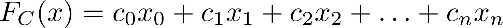
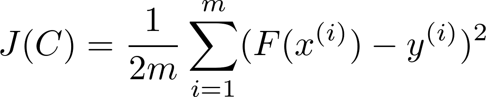
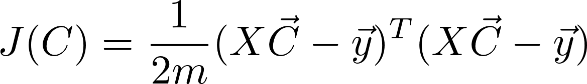
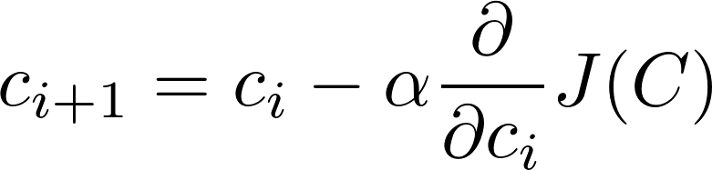
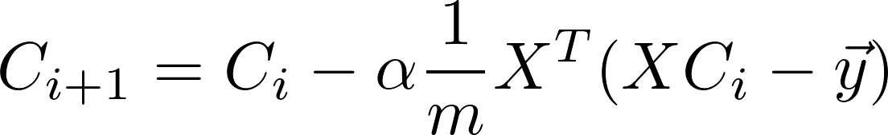

# Machine learning

## Description

Machine learning is quite a fascinating subfield of computer science so I decided to learn more about it. This repository contains some of the code that I have written in order to introduce myself to various concepts of machine learning. 

Who knows, maybe one day this will become an open source machine learning library... It may not be the [TensorFlow](https://www.tensorflow.org/) but this code should give you a basic understanding of the fundamentals. I will try to comment the code the best I can and give some basic theory behind the concepts in this README file.

<b>NOTE:</b> Readers should be familiar with linear algebra and calculus.

## Multivariable Linear Regression

In statistics, [linear regression](https://en.wikipedia.org/wiki/Linear_regression) is an approach for modeling the relationship between a scalar dependent variable y and one or more explanatory variables (or independent variables) denoted X.

In a nutshell this means that for any two given data sets of points X and Y we are trying to find a relationship F such that F(x) = y where x represents the input state and y represents the output for the corresponding input state x.

In this case we are investigating F(x) that looks something like this:
	

i.e. we are trying to find a set of coefficients C such that F(x) is as close to y as possible.

### Cost Function

We measure how well F(x) describes y using the cost function:

where x^(i) is the i-th set of inputs (or features), y^(i) is the output for x^(i) and m is the number of training examples. We can write this in vector form as:

where C is a vector representing all coefficients, X is the matrix where every row is a vector x^(i) where i is between 1 and m and y is a vector representing all outputs.

### Gradient Descent

In order to find the coefficients C that minimise our cost function J(C) we use the following algorithm:

where alpha is the learning rate. When we substitute our cost function we get:

The idea behind this is that C_i will converge to some vector V which will be the best set of coefficients for our relation F to predict y. We can choose alpha to be a scalar or a diagonal matrix if we want to adjust the learning rate differently for individual coefficients.

### References

* Coursera [machine learning](https://www.coursera.org/learn/machine-learning) course
* [Deep Learning](http://www.deeplearningbook.org/) book by Ian Goodfellow Yoshua Bengio and Aaron Courville

 

